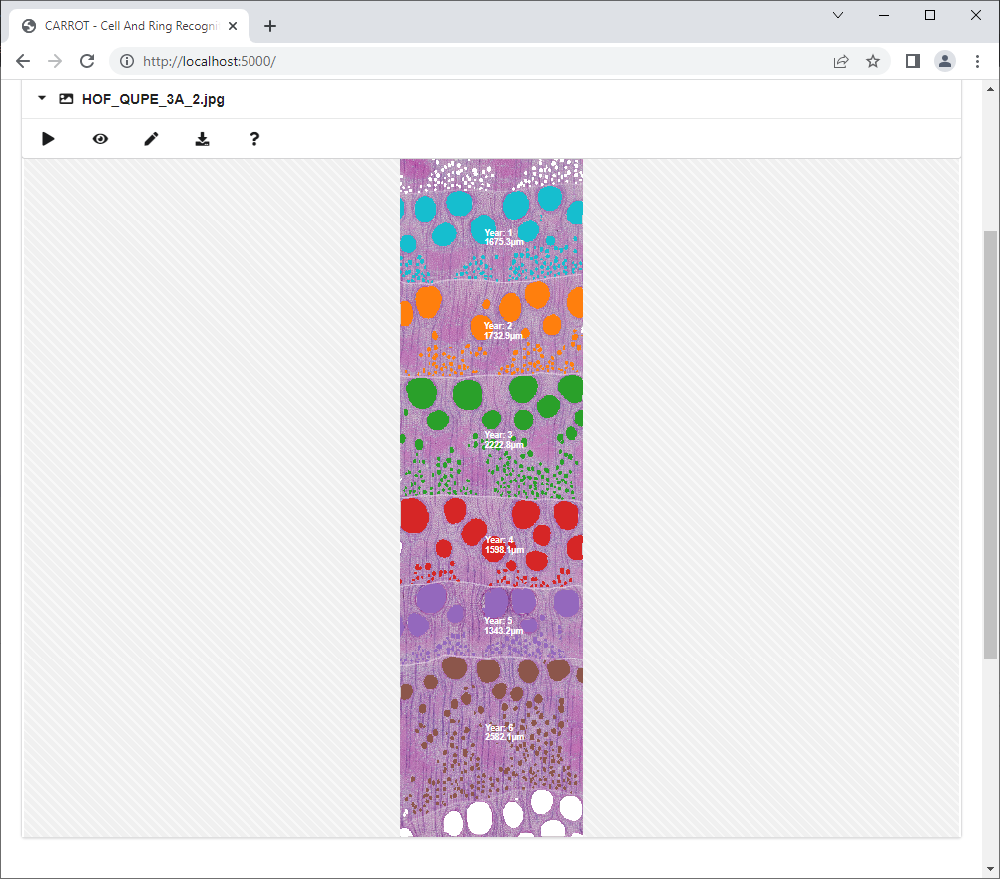

# CARROT
**C**ell **A**nd **R**ing **R**ec**O**gnition **T**ool for Quantitative Wood Analysis

***

Preliminary version download: [Windows Binaries](https://github.com/alexander-g/CARROT/releases/download/v2022-12-26/2022-12-26_16h39m22s_CARROT.zip)

This is not the final version, expect updates in the future with better models and support for [shrub cross sections](https://arxiv.org/pdf/2212.03022).

***

Screenshot:

***

Usage:

- Start `main.bat`, pretrained models for Alnus, Conifer, Fagus and Quercus should get automatically downloaded.
- A browser should automatically open, if not manually navigate to [http://localhost:5000](http://localhost:5000)
- Drag & drop one of the sample images ([Fagus](https://www.dropbox.com/s/v8j3kegh361c24e/000_fagus.jpg?dl=1), [Quercus](https://www.dropbox.com/s/jsx5cyi8bg1zfa3/000_oak.jpg?dl=1)) into the browser
- Make sure that the correct models are selected in the settings
- Click on the "Process" button

